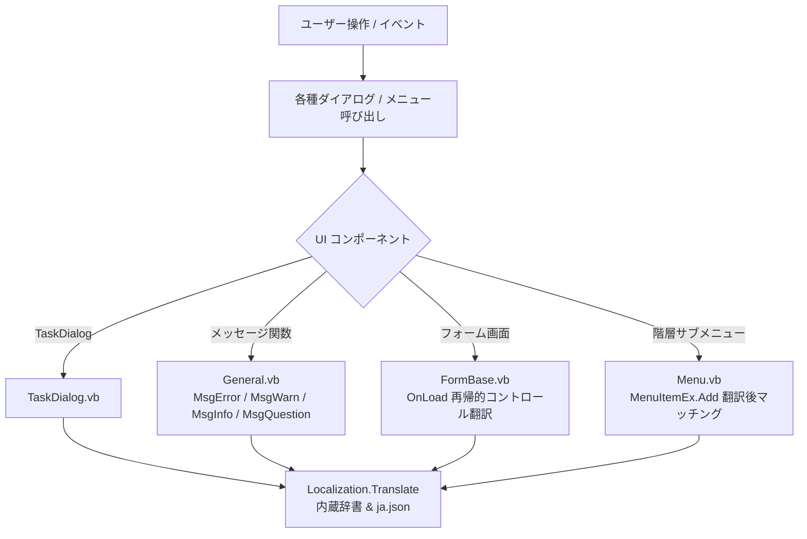

# サブメニュー・ダイアログ・エラーメッセージの網羅的日本語化 実装計画

## 概要
StaxRip のサブメニュー、各種対話ダイアログ（`TaskDialog` および各種フォーム画面）、エラー/警告/確認メッセージ（`MsgError`, `MsgWarn`, `MsgInfo`, `MsgQuestion`, `ShowException` 等）を可能な限り網羅的に日本語化（ローカライズ）します。

---

## ユーザー確認・承認事項

> [!IMPORTANT]
> **ドキュメント生成に関する確認**
> プロジェクトのルールに基づき、本タスクのドキュメント（`task.md`, `implementation_plan.md`, `walkthrough.md`, `handover.md`）をプロジェクト内の `docs/dialog_and_menu_localization/` フォルダ配下に生成して進めます。

> [!NOTE]
> **安全設計方針**
> 1. ボタンの戻り値（`DialogResult` やコマンドの `Tag` / `Value`）は一切改変せず、画面表示テキスト（`.Text`）のみを翻訳します。既存の動作ロジックに影響を与えません。
> 2. `FormBase` での自動翻訳は、ユーザー入力コントロール（`TextBox`, `RichTextBox`, `NumericUpDown` 等）を除外し、ラベル、ボタン、チェックボックス、ListView ヘッダー、タブ、メニュー項目のみを対象とします。
> 3. 辞書に一致しないテキストは元の英語のまま維持されるため、不完全な翻訳や未登録テキストによる例外・表示崩れは発生しません。

---

## 実装内容とアーキテクチャ



### 1. メッセージ・ダイアログ共通基盤のローカライズ (`General.vb` & `TaskDialog.vb`)
- **[General.vb](../../Source/General/General.vb)**:
  - `MsgError`: `title`, `content` を `Localization.Translate` 経由にする。
  - `Msg`: `title`, `content` を `Localization.Translate` 経由にする。
  - `MsgWarn`: `text`, `content` を `Localization.Translate` 経由にする。
  - `MsgOK`: `title` を `Localization.Translate` 経由にする。
  - `MsgQuestion`: `title`, `content` を `Localization.Translate` 経由にする。
- **[TaskDialog.vb](../../Source/UI/TaskDialog.vb)**:
  - `Init()` 内で、`Title`, `Content`, `ExpandedContent` を `Localization.Translate`。
  - コマンドボタン（`CommandDefinitions`）の `Text` および `Description` を `Localization.Translate`。
  - ボタン定義（`ButtonDefinitions`）の `bd.Text` を `Localization.Translate`（※`Tag` や戻り値は保持）。
  - `Buttons` プロパティの定型ボタン（OK, Yes, No, Cancel, Retry, Close）の表示名を「OK」「はい」「いいえ」「キャンセル」「再試行」「閉じる」にローカライズ。
  - `ShowCopyButton` の "Copy Message"（メッセージをコピー）、コピー完了メッセージ（"Message was copied to clipboard."）の日本語化。

### 2. サブメニュー階層構築の修正 (`Menu.vb`)
- **[Menu.vb](../../Source/UI/Menu.vb)**:
  - `MenuItemEx.Add`（482行目付近）：
    既存の親メニュー探索で `If i.Text = a(x) Then` となっている箇所を、
    `If i.Text = a(x) OrElse i.Text = Localization.Translate(a(x)) Then` に修正。
    親メニュー名が既に日本語化されている場合でも正しく同一メニューとして検出され、サブメニューが重複生成される問題を解決。

### 3. 各種ダイアログフォームの自動コントロール翻訳 (`FormBase.vb` & `Localization.vb`)
- **[Localization.vb](../../Source/General/Localization.vb)**:
  - `ApplyLocalization(control As Control)` ヘルパーを追加：
    - フォーム自身のタイトル（`control.Text = Translate(control.Text)`）
    - 子コントロール群（Button, Label, CheckBox, RadioButton, GroupBox, TabPage, ColumnHeader 等）の `.Text` を安全に走査・翻訳。
    - メニュー・ツールバー（`ToolStrip`, `MenuStrip`, `ContextMenuStrip`）の `ToolStripItem` を再帰的に走査・翻訳。
    - `TextBox`, `RichTextBox`, `NumericUpDown` などのデータ入力コントロールは除外。
- **[Misc.vb (FormBase)](../../Source/UI/Misc.vb)**:
  - `OnLoad` 時に `Localization.ApplyLocalization(Me)` を実行。
  - これにより、`AppsForm`（外部ツール管理）、`JobsForm`（ジョブ一覧）、`AudioForm`（音声設定）、`SourceFilesForm`、`CropForm`、`HelpForm`、`LogForm` などの各種設定画面やダイアログのUI要素が一括で日本語化。

### 4. 辞書データの網羅的拡充 (`Localization.vb` & `Source/Settings/Languages/ja.json`)
- コードベース全体から抽出した以下の項目を追加：
  1. **エラー・警告・情報・確認メッセージ（約60項目）**:
     - ファイル未検出、一時フォルダ作成失敗、スクリプトエラー、AviSynth/VapourSynth ポータブル動作通知、字幕形式制限、3Dデマックス未対応、設定リセット確認、テンプレート復元確認、ジョブ追加通知、アップデート通知など。
  2. **ダイアログボタン・定型UI文字列（約20項目）**:
     - 「はい」「いいえ」「キャンセル」「再試行」「閉じる」「メッセージをコピー」など。
  3. **サブメニュー・コンテキストメニュー項目（約50項目）**:
     - AppsForm（パス編集、検索、全チェック、必須のみチェック、自動更新、ダウンロード、サイト、フォルダを開く、起動など）
     - JobsForm（開始、停止、一時停止、再開、上へ、下へ、削除、ログ、状態、開始時刻、所要時間など）
     - AudioForm / MuxerForm / CommandLineDemuxForm（音声トラック追加、ストリーム、言語、遅延、ノーマライズなど）
     - テンプレート選択ダイアログ、メニューエディタなど。

---

## 検証計画

### 1. ビルド検証
- Visual Studio 2026 MSBuild を使用して Release / x64 でコンパイルを実行し、構文エラー（0件）および警告なしを確認。
  ```powershell
  & "C:\Program Files\Microsoft Visual Studio\18\Community\MSBuild\Current\Bin\MSBuild.exe" "Source\StaxRip.vbproj" /p:Configuration=Release /p:Platform=x64
  ```

### 2. ヘッドレス自動テストスイートの実行
- [run_headless_tests.ps1](../../run_headless_tests.ps1) を拡張し、以下を検証：
  - 新規追加したダイアログメッセージ、エラーメッセージ、サブメニュー項目の辞書引きテスト
  - `TaskDialog` のボタンテキスト翻訳（OK, Yes, No, Cancel 等）と戻り値の一致検証
  - コントロール再帰的ローカライズ（`ApplyLocalization`）の動作検証
  - エンコード機能（CRF/2pass/リサイズ等）の回帰テスト
  - テスト用動画ファイルのクリーンアップ確認

### 3. ドキュメント作成
- `docs/dialog_and_menu_localization/` フォルダに `task.md`, `implementation_plan.md`, `walkthrough.md`, `handover.md` を作成・保存。
